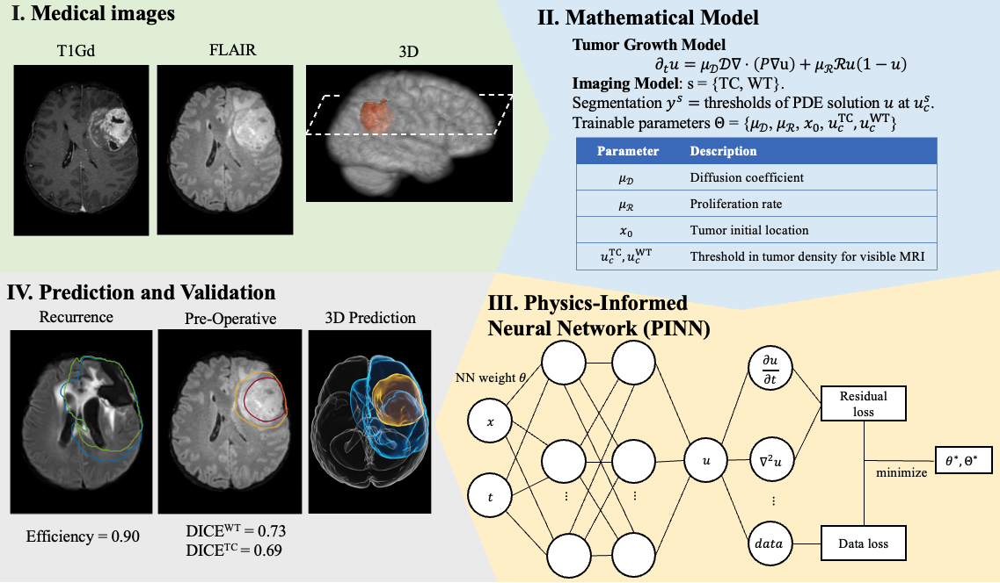

# Personalized Predictions of Glioblastoma Infiltration: Mathematical Models, Physics-Informed Neural Networks and Multimodal Scans


This repository contains the code the paper 

**Personalized Predictions of Glioblastoma Infiltration: Mathematical Models, Physics-Informed Neural Networks and Multimodal Scans**

*Ray Zirui Zhang, Ivan Ezhov, Michal Balcerak, Andy Zhu, Benedikt Wiestler, Bjoern Menze, John Lowengrub.*

Medical Image Analysis, 2025. [[Journal](https://www.sciencedirect.com/science/article/pii/S1361841524003487)] [[arXiv](https://arxiv.org/abs/2311.16536)]





## Citation
If you find this code useful in your research, please consider citing:

```
Zhang, R.Z., Ezhov, I., Balcerak, M., Zhu, A., Wiestler, B., Menze, B., Lowengrub, J.S., 2025. Personalized predictions of Glioblastoma infiltration: Mathematical models, Physics-Informed Neural Networks and multimodal scans. Medical Image Analysis 101, 103423. https://doi.org/10.1016/j.media.2024.103423


@article{ZHANG2025103423,
title = {Personalized predictions of Glioblastoma infiltration: Mathematical models, Physics-Informed Neural Networks and multimodal scans},
journal = {Medical Image Analysis},
volume = {101},
pages = {103423},
year = {2025},
issn = {1361-8415},
doi = {https://doi.org/10.1016/j.media.2024.103423},
url = {https://www.sciencedirect.com/science/article/pii/S1361841524003487},
author = {Ray Zirui Zhang and Ivan Ezhov and Michal Balcerak and Andy Zhu and Benedikt Wiestler and Bjoern Menze and John S. Lowengrub},
}
```


## Dataset and Simulations

[Dataset and example scripts](https://drive.google.com/drive/folders/1vizr-eytL2EBhO2KuQrpzsn3McnvwLWT?usp=sharing)

Patient data P1-P8 in the paper is obtained from

*Lipkova et al., Personalized Radiotherapy Design for Glioblastoma Using Mathematical Tumor Modelling, Multimodal Scans and Bayesian Inference. IEEE Transactions on Medical Imaging (2019)* [[Paper]](https://ieeexplore.ieee.org/document/8654016) [[GitHub&Data]](https://github.com/JanaLipkova/GliomaSolver).
